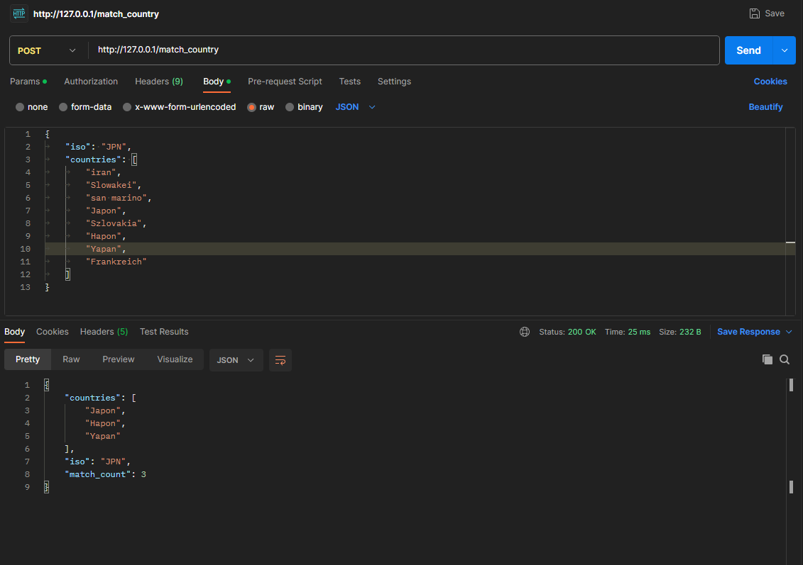
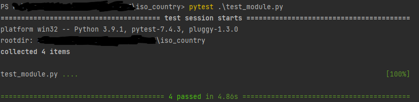

## Files
### server.py
Server that handles the requests
### data_fetcher.py
Class that loads the data and stores it in json file
### test_module.py
Tests for the project
### data.json
Scrapped data from wikipedia (used for word matching)

## Usage
Create possibly a virtual environment for python and install dependencies

```bash
pip install -r requirements.txt
```


Run server with
```bash 
python3 server.py
```

## Call
Call the server with curl or postman
```bash
curl -X POST localhost/match_country -H "Content-Type: application/json" -d '{"iso":"svk","countries":["iran","Slowakei","Vatikan","Slovaška","Szlovakia","Belgrade","España","Nizozemsko"]}'
```

Image of the call in postman



## Tests
Run tests with
```bash
pytest test_module.py
```

Image of test console output



